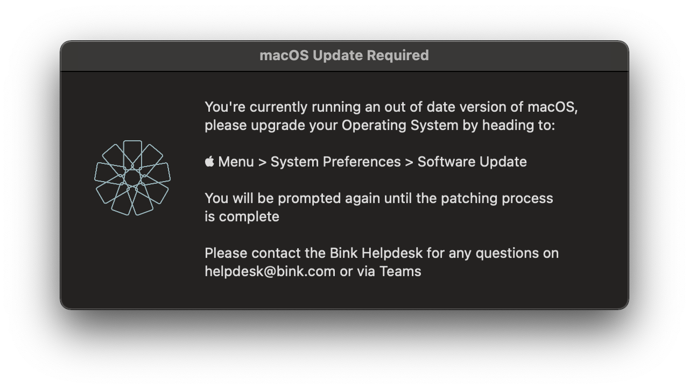

# Patch Nagscreen

We find encouraging users to stay up to date quite difficult at times and the built in patching mechanisms provided by Apple/Jamf are very unreliable. Couple this with our use of Microsoft Conditional Access and users can get themselves into a real jam.

This script displays a nag screen on every checkin interval (15 minutes by default) for 60 seconds. We deploy this a day or two before our patch deadlines and often find that > 90% of users have patched by lunchtime.

Is this the right way to do things? No. But does it work? Yes.
